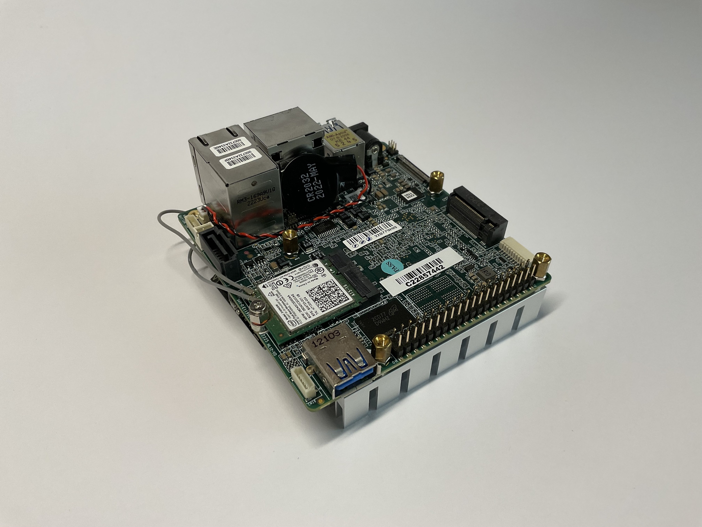
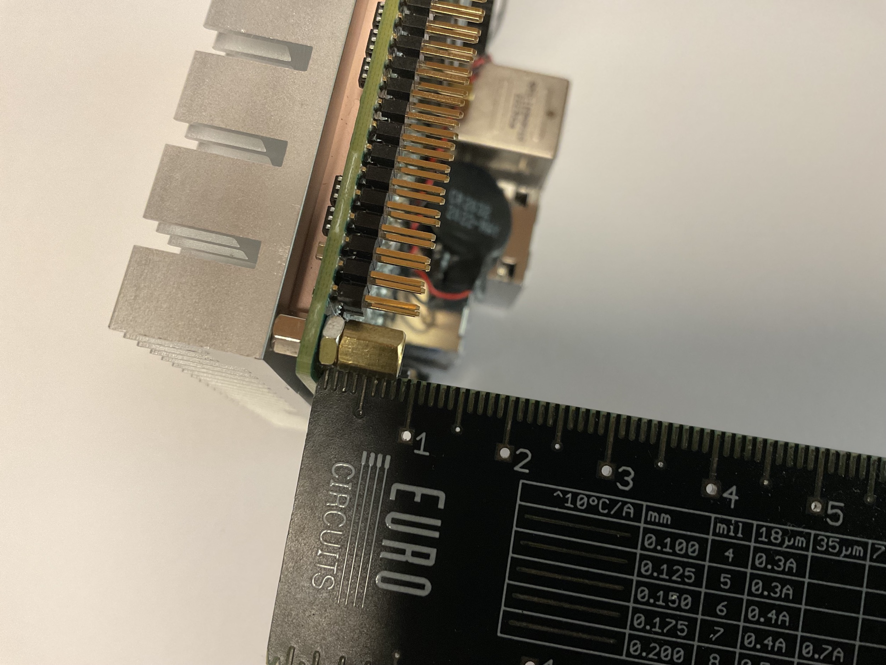
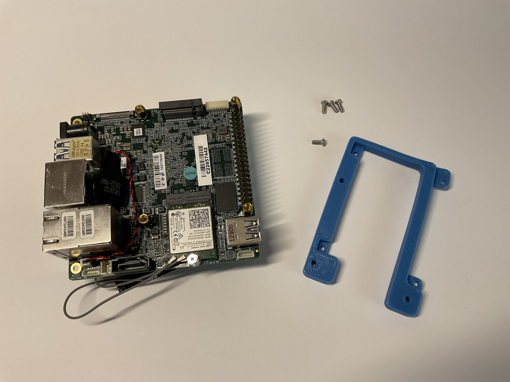
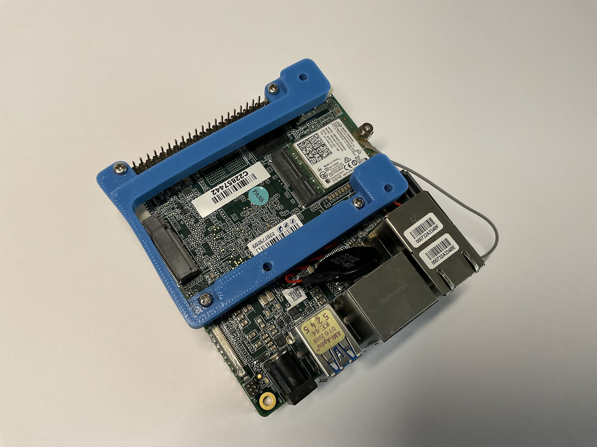
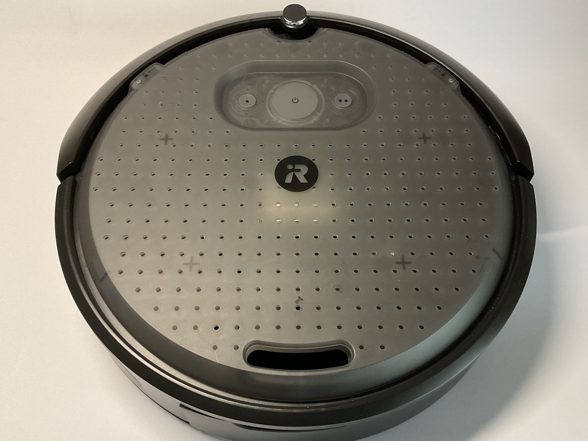
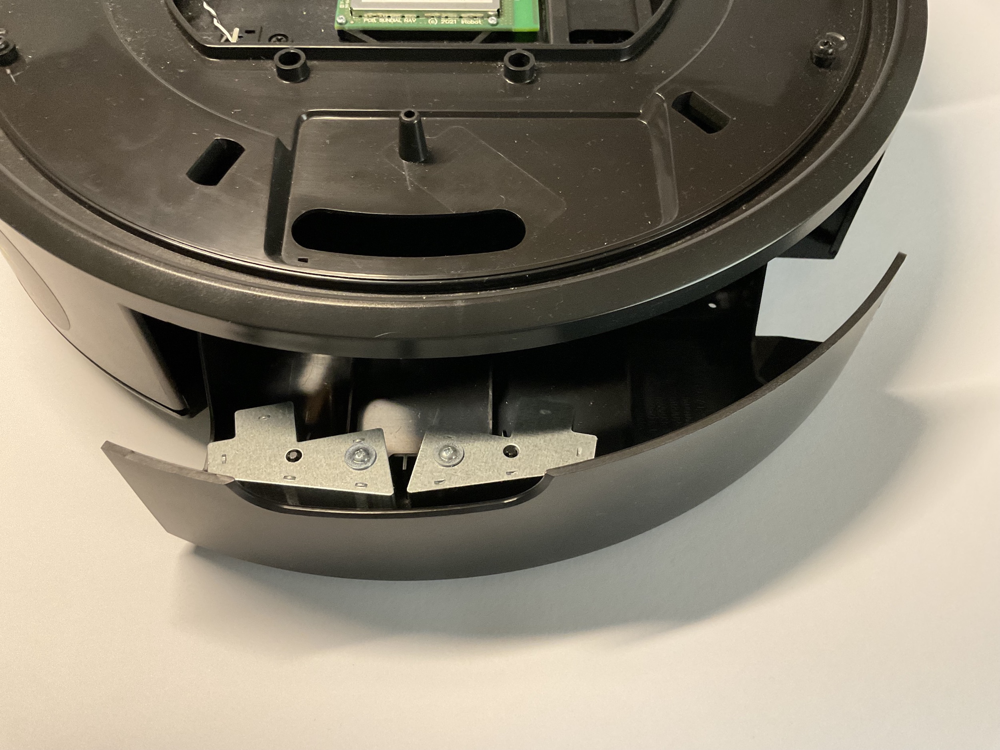
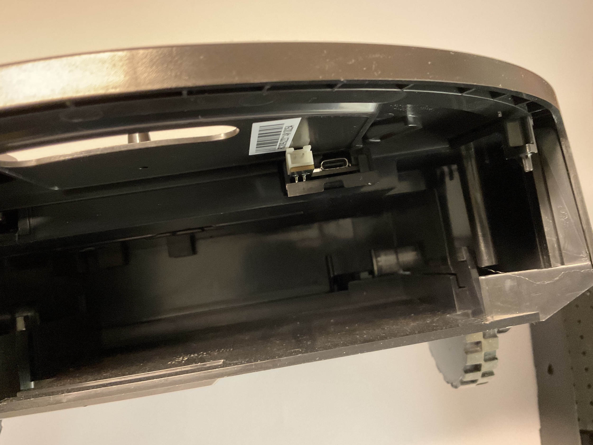
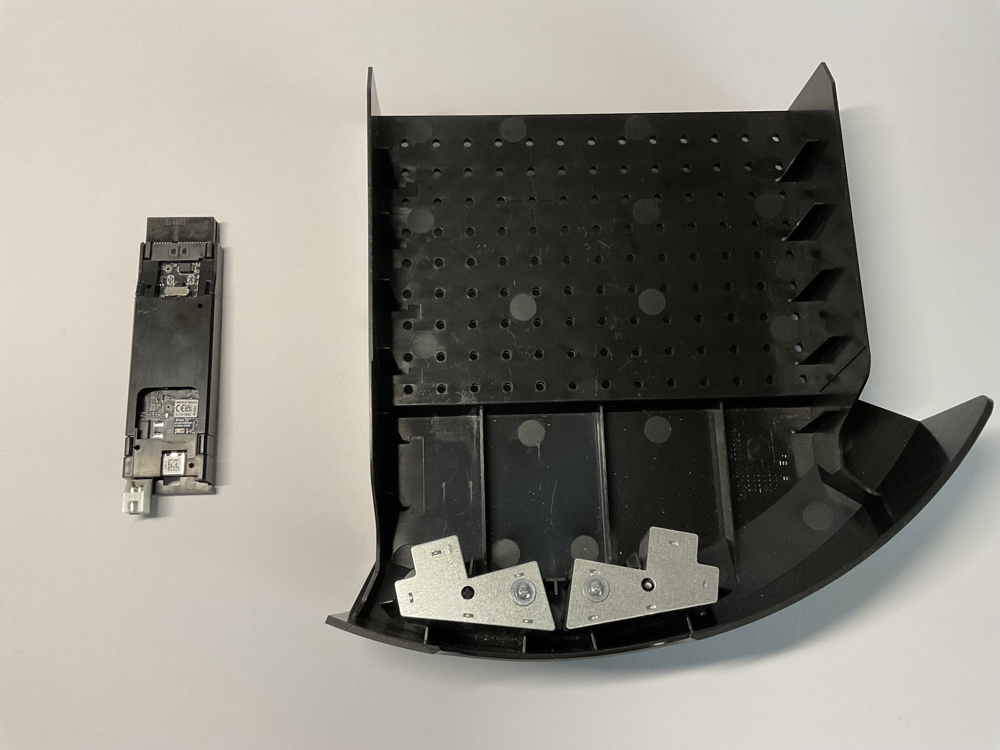

# 1. Initial Preparation

> ***NOTE: steps from 1 and 2 are optional***

## 1. OPTIONAL: UP2v2 preparation
_This step is not required to the correct functionalities of the robot._

You need to mount the WiFi kit. Then remove the heatsink screws and mount standoffs.
In this step you may want to swap to active heatsink.

Each of the four standoffs needs a M2.5 nut as spacer.
In the following photo is shown a 6+6 standoff. Using a nut it can be used as a 4+8 standoff.

## 2. OPTIONAL: Mount the UP Squared v2 3d printed adapter 

_This step is not required to the correct functionalities of the robot._

You need the UP2v2, 3d printed adapter and 4 M2.5x6 screws.

Align the adapter to the 4 standoffs and 40 GPIOs.

Final result. The adapter allows also to use the M2280 mount.

## 3. Prepare iRobot Create® 3

Bring your iRobot Create® 3

Remove the cover by turning it counterclockwise.

Remove the cargo bay.

Remove the adapter board.

You obtain 2 macro parts: cargo bay and adapter Board

## 4. Configure adapter board

Put the switch on the USB logo, this will configure the iRobot Create® 3 to work through USB C and not via bluetooth.

## 5. Next steps

In the next part of assembly instructions you will be guided to the preration of the cargo bay.

[Cargo bay preparation](02_cargo_bay.md)

>Copyrights © 2022 G. Bruno gbr1.github.io under MIT License
