# 2. Cargo bay preparation

## 1. UP2v2 ethernet cable
Connect the ethernet cable to port near the heatsink
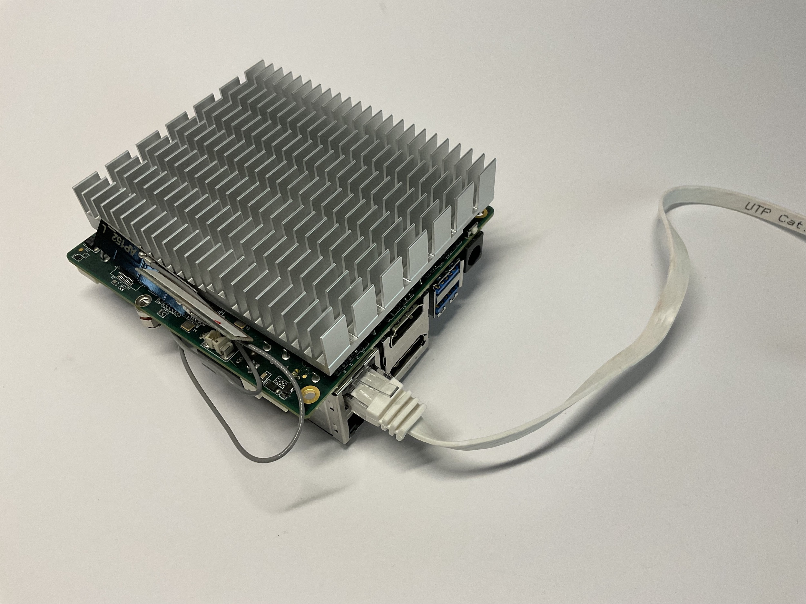

## 2. OPTIONAL: UP2v2 HDMI extension adapter
_This step is not required to the correct functionalities of the robot._

If you want you can mount the hdmi angled extension adapter

## 3. OPTIONAL: UP2v2 USB3 extension adapter
_This step is not required to the correct functionalities of the robot._

If you want you can mount the usb angled extension adapter
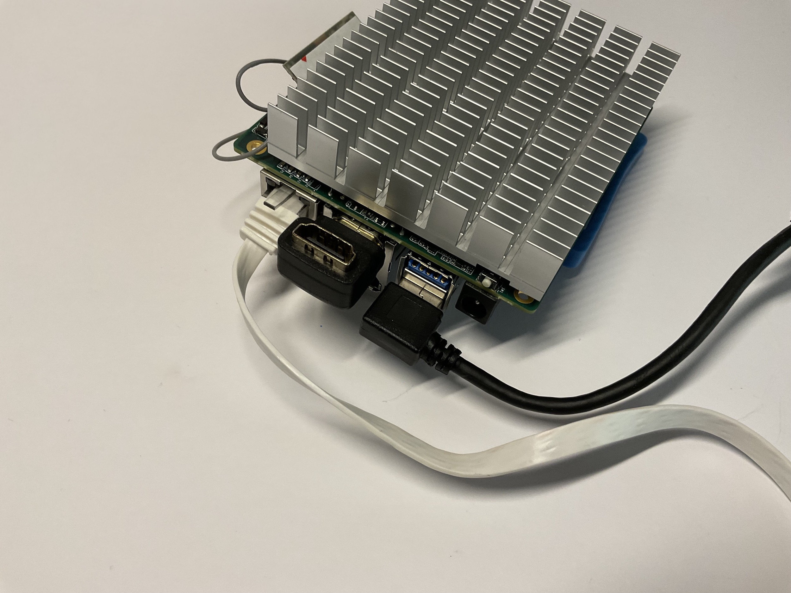

## 4. UP2v2 Power jack

Attach the power jack. Take care about polarity (positive center) and size (5.5-2.1 mm)

## 5. OPTIONAL: Mount UP2v2 

_This step is not required to the correct functionalities of the robot._

You need 3 M3x8 screws and if you want optional washers.

Place the UP2v2 as shown in the photo.
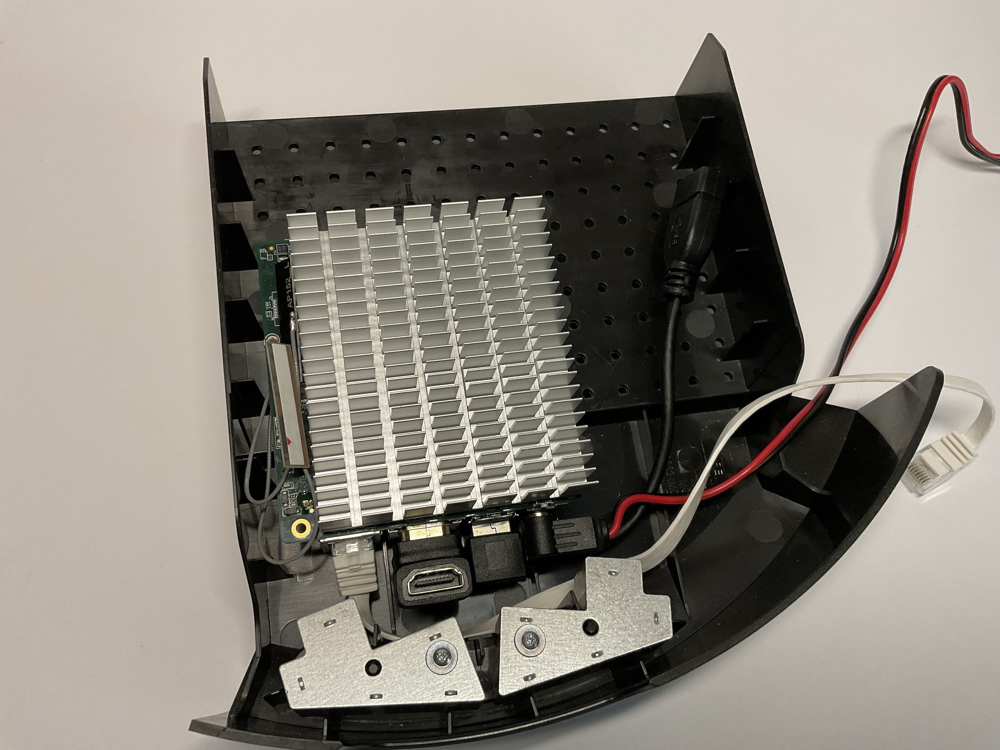

The board must be aligned with the following screws
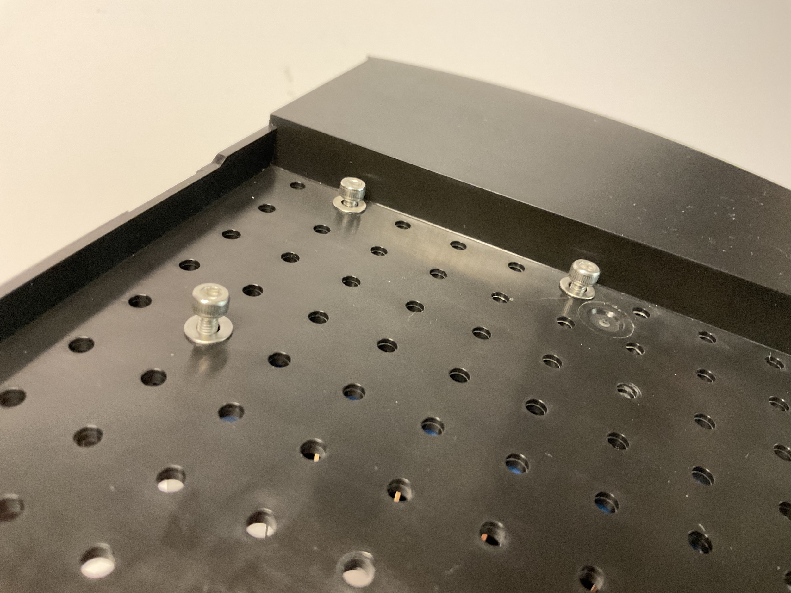
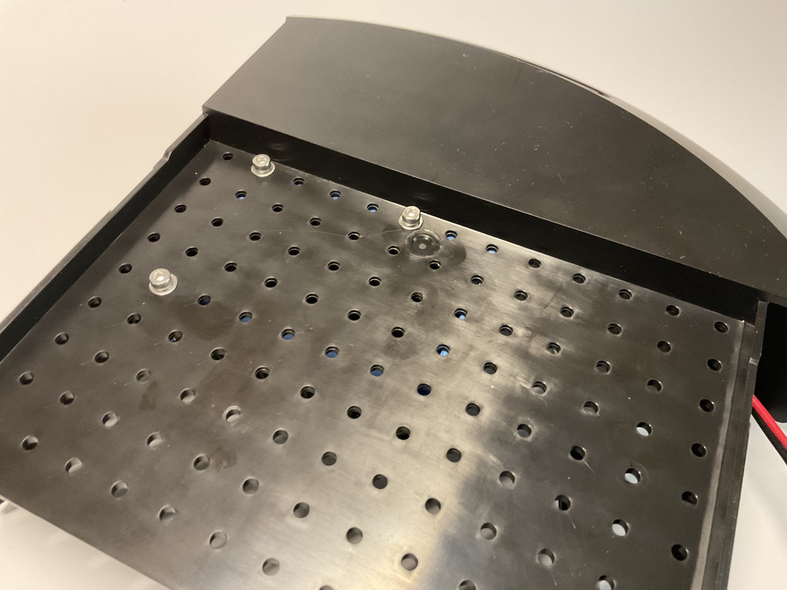

The following is the result.

## 6. DC-DC

Place the DC-DC adapter.
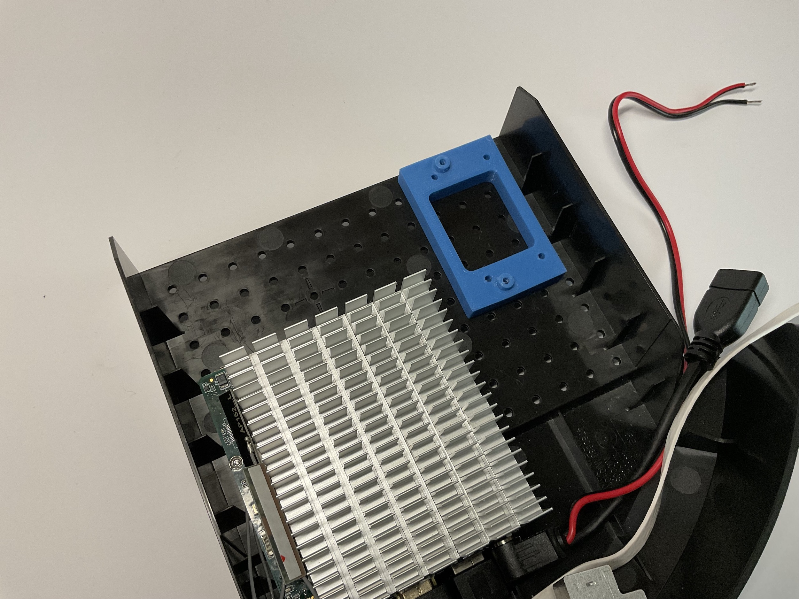

Secure using 4 M3x8 screws with optional washers.
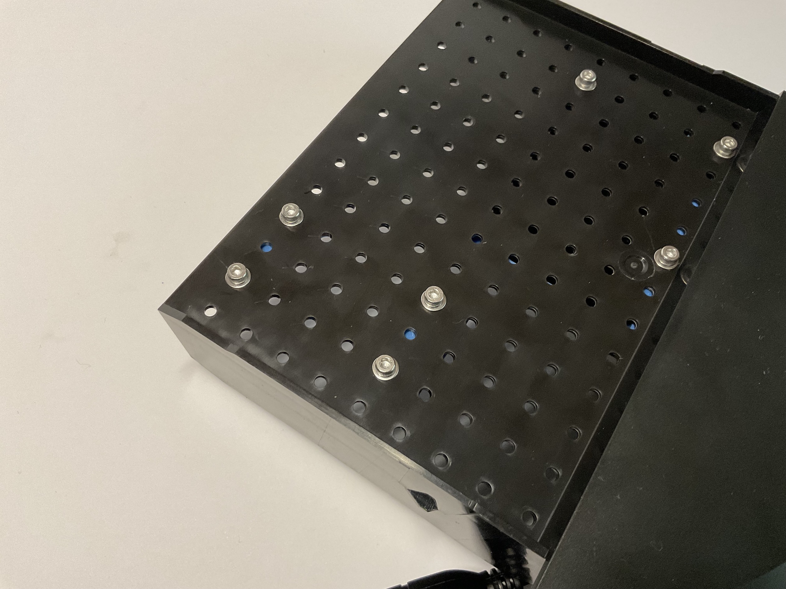

Place the DC-DC as shown in the photo.
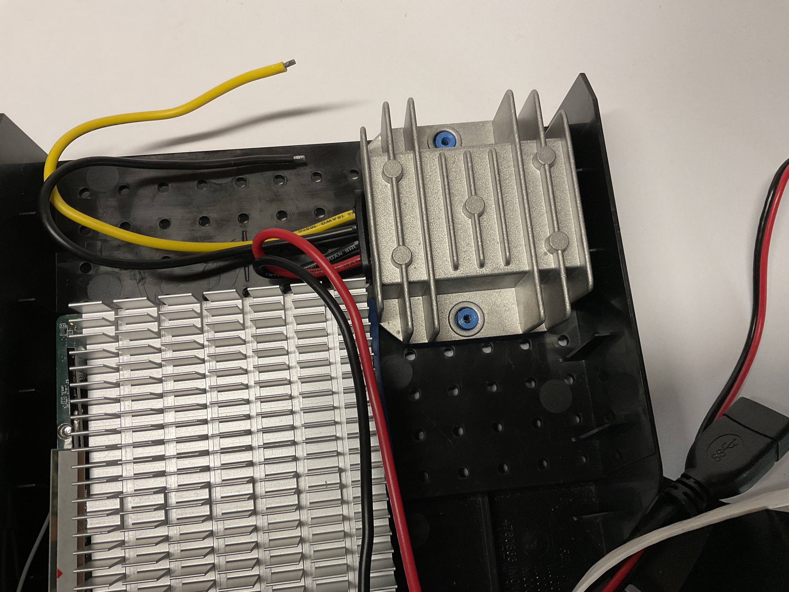

Secure using two 3d printed washers and 2 M3x6 screws.
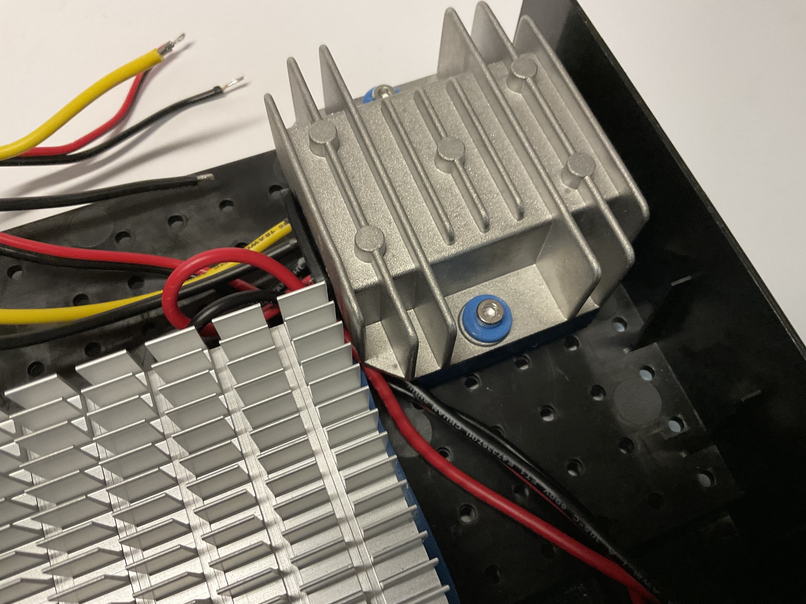

## 7. OPTIONAL: Cables management

Place cables as shown in photo.

Using 2 WAGO221 or 2 screwed connectors connect:
- power jack red cable (+12V) to the output of the DC-DC yellow cable (+12V)
- power jack black cable (GND) to the output ot the DC-DC black cable (GND)

Now get the JST cable from the iRobot Create® 3 box
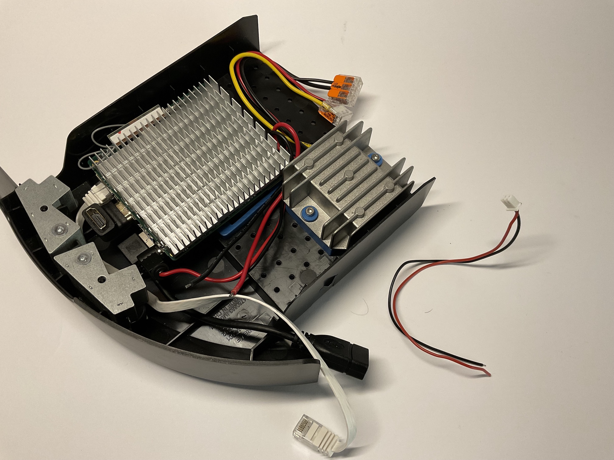

Using 2 WAGO221 or 2 screwed connectors connect:
- JST red cable (+) to the input of the DC-DC red cable (+)
- JST black cable (GND) to the input ot the DC-DC black cable (GND)

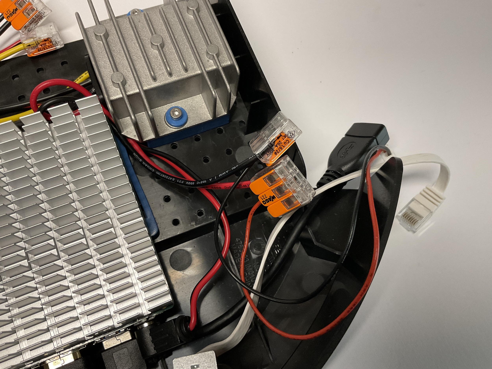

Connections must follow this scheme:

## 8. Connect USB C to ethernet adapter

Now bring the USB C to Ethernet adapter.

Plug the ethernet cable inside the adapter and place is as shown.

_Optionally use some cable ties to fix cables_

## 9. Connect the adapter board

Connect the JST cable and the USB C adapter to the adapter board.
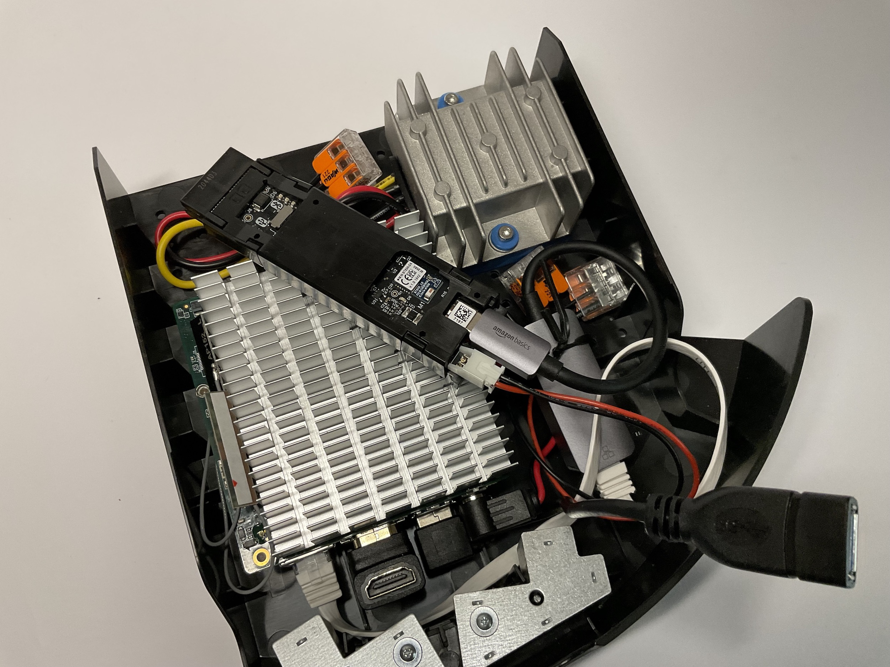

## 10. USB C cable

Connect the USB A to USB C cable from the Intel Realsense box to the UP Squared v2.
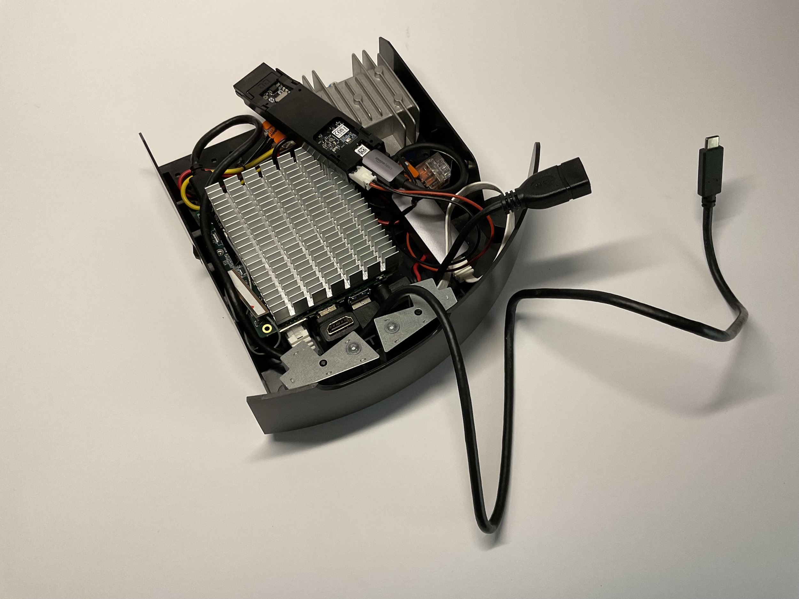

## 11. Next steps

In the next part of assembly instructions you will be guided to the final assembly of the robot.

[Final assembly](03_final_assembly.md)

>Copyrights © 2022 G. Bruno gbr1.github.io under MIT License
