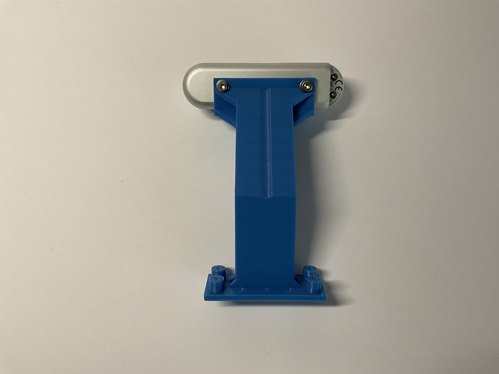
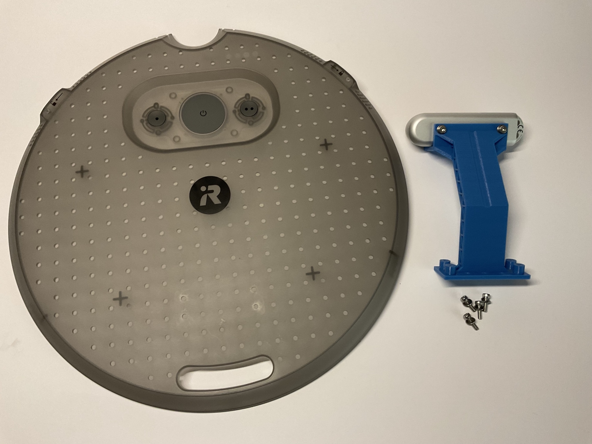
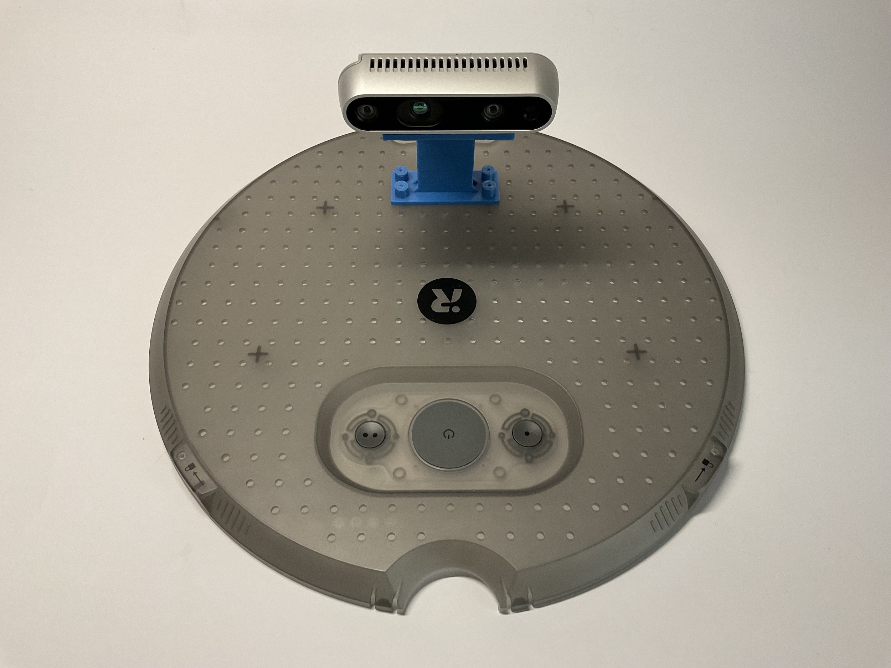
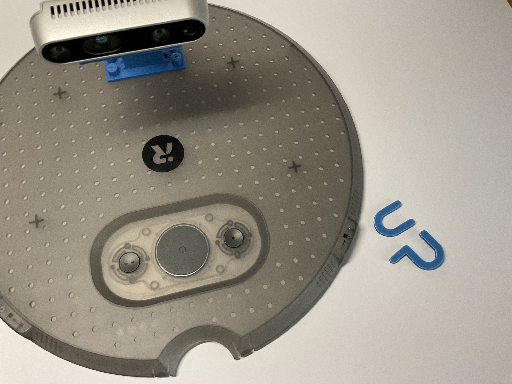
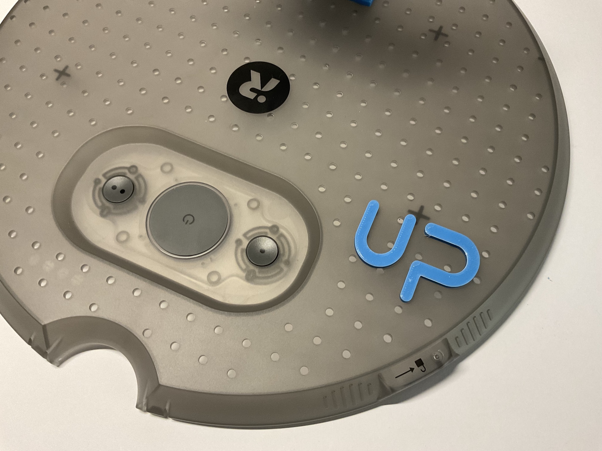
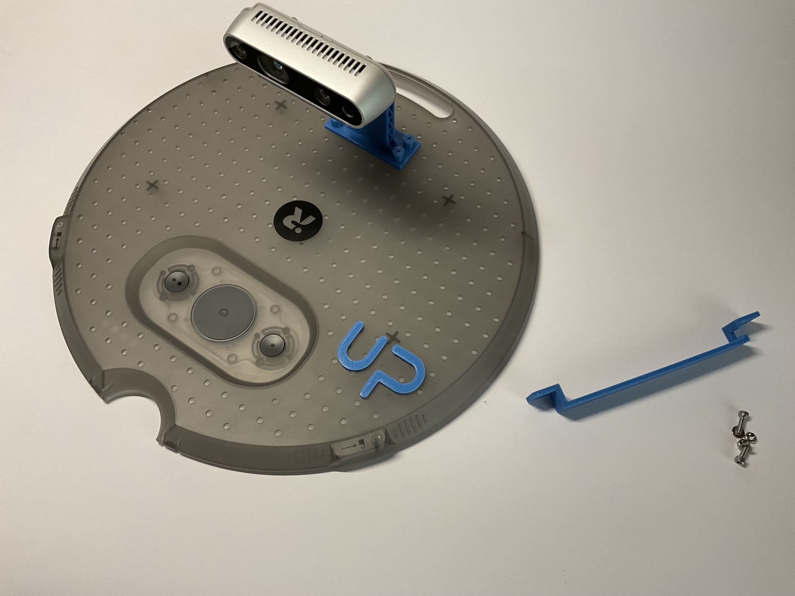
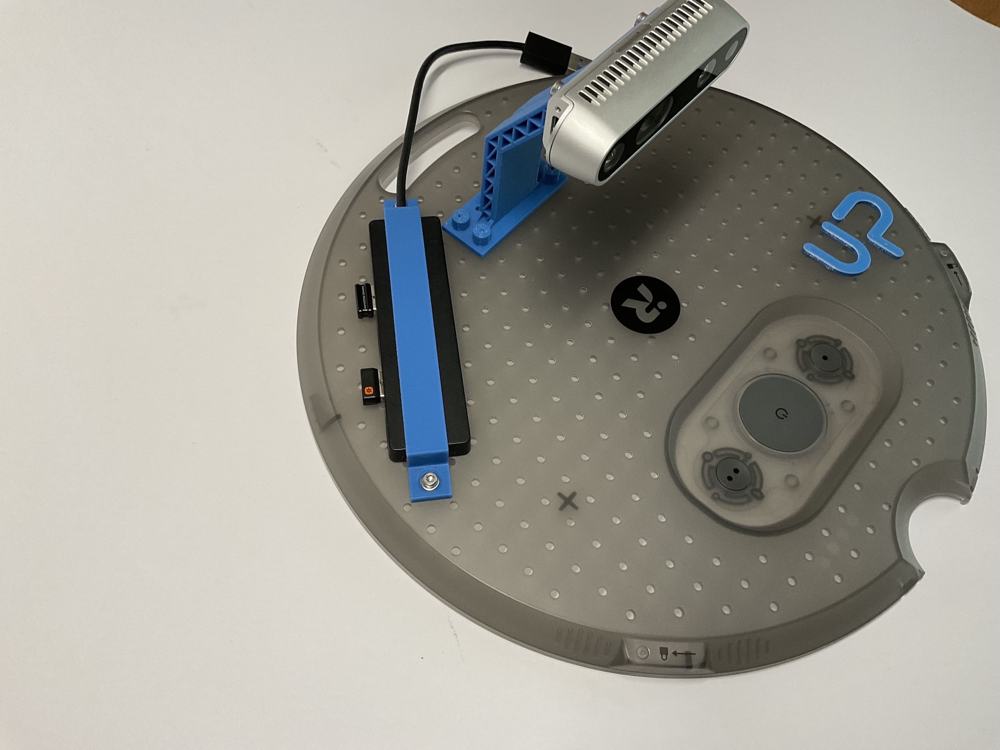
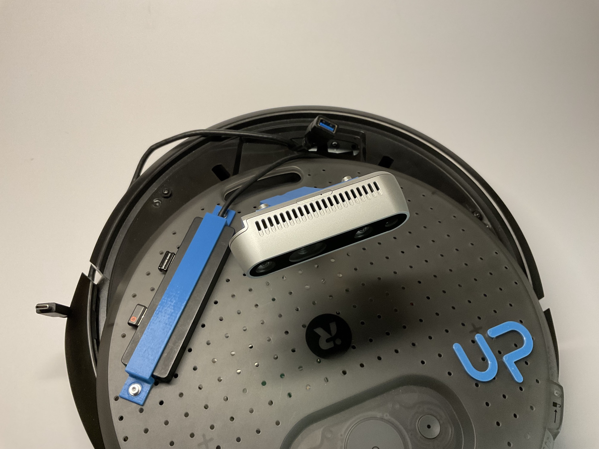
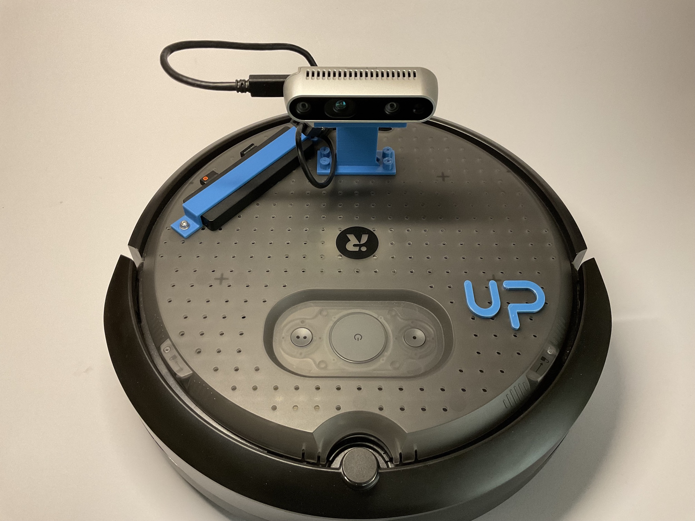
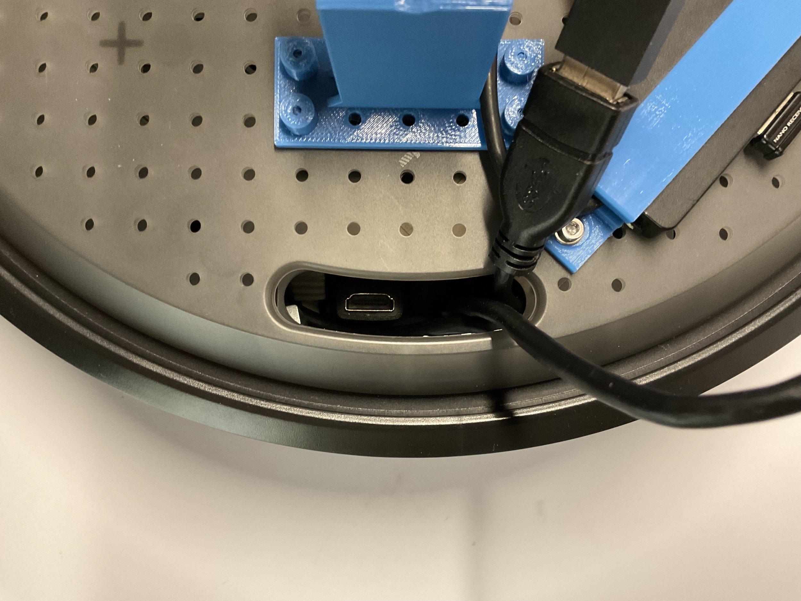

# 3. Final assembly

## 1. Intel Realsense assembly

Bring the Intel Realsense D435, 2 M3x6 screws with optional washer and the 3d print bracket.

Mount the camera using the 2 screws as following.

Prepare 4 M3x10 screws with optionally washers.

Place the camera as shown in the following photo.

Here the final result.

## 2. OPTIONAL: mount the UP logo

_This step is not required to the correct functionalities of the robot._

If you have printed the logo you can mount it in the following steps. You may use different screws depending on your 3d printer.

Here an example of mounting.

## 3. OPTIONAL: mount an USB Hub

_This step is not required to the correct functionalities of the robot._

Following steps were designed by using an Anker 4 port USB3 usb hub.
3d print and adapter.

Mount the adapter.

Insert the USB hub.

## 4. Final assembly
Start inserting the cargo bay inside the robot chassis and plug the adapter board.

Pass the cables in the slot and close the cargo bay.

Pass the cable also in the cover and fix it by turing clockwise.

## 5. The UP Create® 3

If you have mounted the optional hdmi angled adapter you will be able to connect you monitor through the slot. :D

